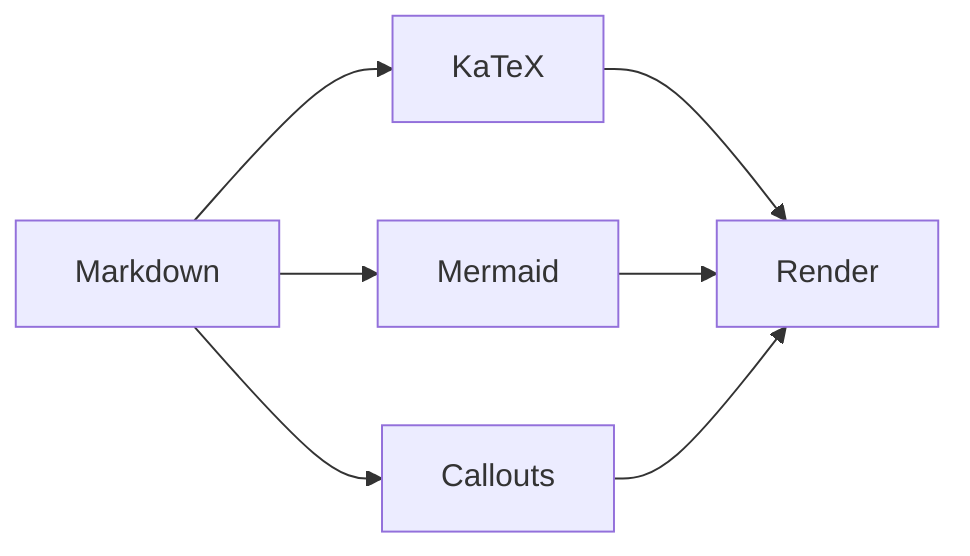

## Tipografía básica

**Negrita**, *cursiva*, ~~tachado~~, `código inline`, ~~~cursiva~~~

## Listas

1. Item ordenado
   - Subitem anidado
     1. Sub-subitem
2. Otro item

- [x] Tarea completada
- [ ] Tarea pendiente
- [ ] Tarea por hacer

## Tablas

| Feature | Estado | Versión |
|---------|--------|---------|
| Callouts | ✅ | 1.0 |
| KaTeX | ✅ | 1.0 |
| Mermaid | ✅ | 1.1 |
| Comentarios | ❌ | 2.0 |

{.table-rounded}

## Callouts

> [!note] Nota
> Información útil para el lector.

> [!tip] Tip
> Un consejo práctico.

> [!warning] Atención
> Algo que requiere cuidado.

> [!danger] Peligro
> Esto puede romper algo.

> [!important]- Colapsable
> Haz clic en el título para expandir.
>
> Contenido oculto.

## KaTeX

Fórmula inline: $e^{i\pi} + 1 = 0$

$$
\sum_{n=1}^{\infty} \frac{1}{n^2} = \frac{\pi^2}{6}
$$

$$
\nabla \times \mathbf{E} = -\frac{\partial \mathbf{B}}{\partial t}
$$

## Mermaid



## Wikilinks

Enlaces estilo Obsidian: [[code-showcase]]

Texto personalizado: [[code-showcase|Ver showcase de código]]

## Highlight

Texto ==resaltado== con el plugin remark-obsidian.

## Details HTML

<details>
<summary>Haz clic para expandir</summary>

Contenido oculto con **markdown** dentro de `<details>`.

```js
console.log('Funciona dentro de details');
```

</details>

## Código con line numbers

```js {3,6-7}
function fibonacci(n) {
  let a = 0, b = 1;
  for (let i = 0; i < n; i++) {
    [a, b] = [b, a + b];
  }
  return a;
}

console.log(fibonacci(10)); // 55
```

## Código plegable

```js wrap collapsible title="utils.js"
function formatDate(date) {
  return new Intl.DateTimeFormat('es', {
    year: 'numeric',
    month: 'long',
    day: 'numeric',
  }).format(date);
}

function slugify(text) {
  return text
    .toLowerCase()
    .replace(/[^\w\s-]/g, '')
    .replace(/\s+/g, '-');
}
```

Este post cubre la mayoría de las capacidades del pipeline markdown del tema **Ri**, incluyendo plugins personalizados para Obsidian, Mermaid, KaTeX y callouts.
