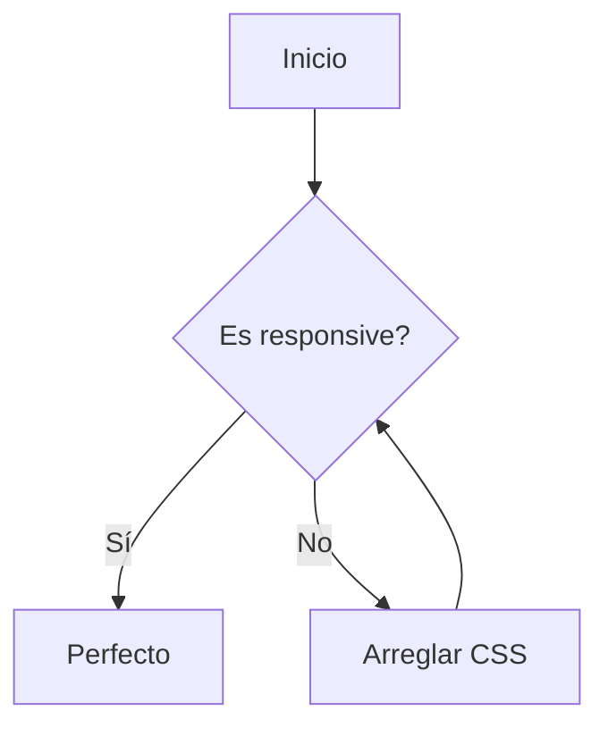
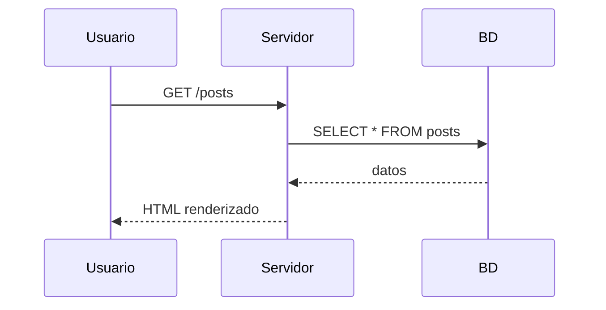

## Tipografía

# Heading 1
## Heading 2
### Heading 3
#### Heading 4

**Negrita**, *cursiva*, ~~tachado~~, `código inline`, [link](https://example.com)

---

## Listas

### Ordenada
1. Primer item
2. Segundo item
3. Tercer item

### No ordenada
- Item uno
- Item dos
  - Subitem anidado
  - Otro subitem
- Item tres

### Checkbox
- [x] Tarea completada
- [ ] Tarea pendiente
- [ ] Otra tarea

---

## Código

### JavaScript
```js
function greet(name) {
  const msg = `Hello, ${name}!`;
  console.log(msg);
  return msg;
}

greet('Ri');
```

### Python
```python
def fibonacci(n):
    a, b = 0, 1
    for _ in range(n):
        yield a
        a, b = b, a + b

print(list(fibonacci(10)))
```

### HTML
```html
<div class="container">
  <h1>Hello World</h1>
  <p>This is a test.</p>
</div>
```

### Shell
```bash
npm run build
npx pagefind --site dist
```

---

## KaTeX

### Inline
Esto es una fórmula inline: $E = mc^2$ y sigue el texto.

### Display
$$
\int_{-\infty}^{\infty} e^{-x^2} \, dx = \sqrt{\pi}
$$

### Ecuación más compleja
$$
\frac{-b \pm \sqrt{b^2 - 4ac}}{2a}
$$

---

## Mermaid

### Diagrama de flujo


### Diagrama de secuencia


---

## Callouts

> [!note] Nota informativa
> Esto es una nota estándar. Útil para información adicional.

> [!tip] Consejo
> Aquí va un tip útil para el lector.

> [!warning] Cuidado
> Precaución con esto. Puede haber efectos secundarios.

> [!danger] Peligro
> Esto puede romper algo. ¡Ten cuidado!

> [!important]- Collapsible
> Este callout se puede colapsar haciendo clic en el título.
> 
> Contenido adicional oculto hasta que se expanda.

> [!quote] Cita
> "El diseño es donde la ciencia y el arte se equilibran."

---


---

## Bloques de cita

> Esto es un blockquote estándar.
> Varias líneas.
>
> Párrafo separado dentro del blockquote.

---

## Tabla

| Característica | Estado | Prioridad |
|---|---|---|
| KaTeX | ✅ Listo | Alta |
| Mermaid | ✅ Listo | Alta |
| Callouts | ✅ Listo | Media |
| Comentarios | ❌ Pendiente | Baja |

---

## Separador

---

## Obsidian-style

### Wikilinks
Enlace a otro post: [[math-and-diagrams]]

Con texto personalizado: [[math-and-diagrams|Ver maths y diagramas]]

### Highlight
Esto es un texto ==resaltado== como en Obsidian.

### Embed
![[blog-placeholder-1.jpg]]

## Obsidian-inspired features

### Callouts avanzados

> [!quote] Una cita con estilo
> El diseño es donde la ciencia y el arte se equilibran.

> [!defini] Definición
> Un callout con borde dotted para definiciones.

> [!pill] Pill Callout
> Este callout tiene el título flotando sobre el borde.

> [!infobox2] Infobox
> | Clave | Valor |
> |---|---|
> | Tipo | Ficha lateral |
> | Estilo | Wikipedia |
> | Uso | Metadatos |

> [!note] Callout normal
> Este callout tiene título.

> [!defini] Definición
> Callout con borde dotted.

### Multi-column

> [!multi-column] Multi-column
> Columna uno con contenido de ejemplo.
>
> Columna dos con más contenido.
>
> Columna tres para completar la fila.

### Tablas

| Normal | Tabla | Ejemplo |
|---|---|---|
| A | B | C |
| D | E | F |

{.table-academia}

| Academia | Style | Tabla |
|---|---|---|
| Solo | bordes | superior/inferior |
| Limpia | minimalista | profesional |

{.table-rounded}

| Rounded | Style | Tabla |
|---|---|---|
| Bordes | redondeados | completo |
| Cabecera | con | estilo |

### Progress bar

<div class="progress-bar">
  <div class="progress-bar-fill" style="width: 75%">
    <span class="progress-bar-text">75%</span>
  </div>
</div>

### Tags
<span class="tag">astro</span>
<span class="tag">documentación</span>
<span class="tag">css</span>

### Card grid
<div class="card-grid">
  <div class="card">
    <div class="card-body">
      <h3 class="card-title">Card One</h3>
      <p class="card-text">Primera tarjeta del grid responsive.</p>
    </div>
  </div>
  <div class="card">
    <div class="card-body">
      <h3 class="card-title">Card Two</h3>
      <p class="card-text">Segunda tarjeta con auto-fit columns.</p>
    </div>
  </div>
  <div class="card">
    <div class="card-body">
      <h3 class="card-title">Card Three</h3>
      <p class="card-text">Tercera tarjeta del grid.</p>
    </div>
  </div>
</div>

## HTML embebido

<details>
<summary>Haz clic para expandir</summary>

Contenido oculto dentro de un `<details>` HTML nativo.

```js
console.log('Esto funciona dentro de details');
```

</details>
